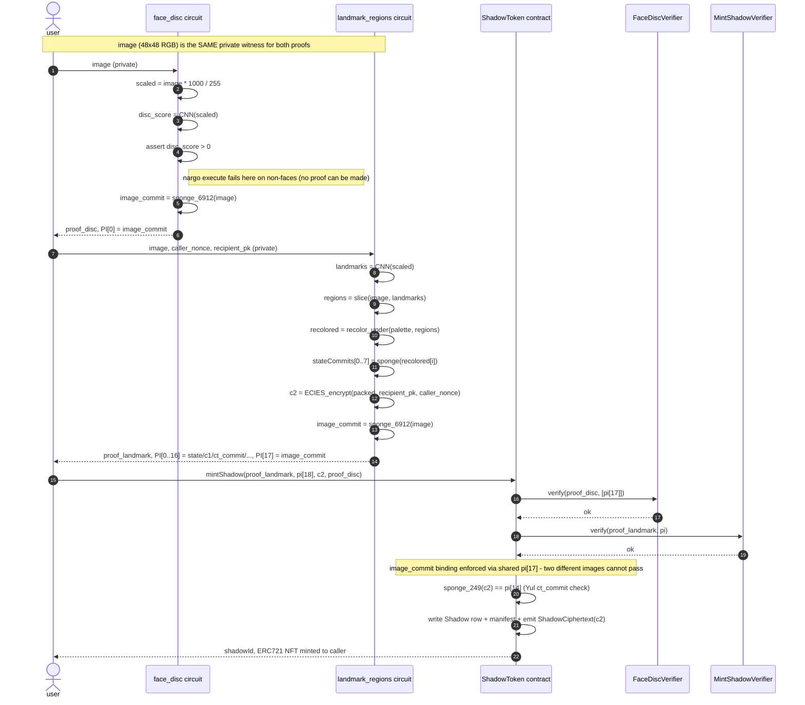

> **v1 historical document.** Describes the architecture deployed on
> Base Sepolia. The `staging` branch has moved on to v2: see
> [`V2_STATUS.md`](V2_STATUS.md) for the as-built v2 surface. Terms like
> `ORIGINAL`, `INSERTED`, `originPose`, `boxesPackedOf`, `c2Commit`,
> `stateCommitsHash`, `removeFeature`, `REGION_W/H`, `stateNonce`,
> `faceOriginId`, `insertedFeatureId` below are v1-only and do not exist
> on `staging`.

---

# Architecture

The shadow token has two layers, deliberately separated.

```
┌──────────────────── Shadow ───────────────────┐
│                                               │
│  origin layer (immutable, set at mint)        │
│    origPose[0..7]      uint64 each            │
│    color               uint8                  │
│    faceOriginId        bytes32                │
│    c2Commit            bytes32                │
│    stateCommitsHash    bytes32                │
│                                               │
│  ────────────────────────────────────────     │
│                                               │
│  manifest layer (mutable, 16 slots)           │
│    slot[i].kind        EMPTY|ORIGINAL|INSERTED│
│    slot[i].originalTypeIdx    (if ORIGINAL)   │
│    slot[i].insertedFeatureId  (if INSERTED)   │
│    slot[i].pose        uint64 (PoseLib)       │
│                                               │
│  ────────────────────────────────────────     │
│                                               │
│  encrypted plaintext (off-chain, owner-only)  │
│    c2[249] (Field)     ECIES ciphertext       │
│                                               │
│  ────────────────────────────────────────     │
│                                               │
│  reveal flag                                  │
│    solved              bool                   │
│                                               │
└───────────────────────────────────────────────┘
```

## Mint flow: two proofs, one image

`mintShadow` requires **two** independent zk proofs in the same call.
Both circuits operate on the same 6912-element CHW (3*48*48) private
image witness; the contract enforces that they refer to the same image
by checking a shared public input.

1. **`face_disc` proof** — runs a small discriminator CNN
   (`Conv[3->4->8->16->16] + x^2 + GAP + Linear(16->1)`, ~1.8k params)
   on the image in i64 fixed-point at scale=1000 and asserts the output
   score is positive. Non-face inputs fail this assertion at `nargo
   execute` time, so a non-face proof cannot be produced. Public input:
   `PI[0] = image_commit = poseidon2_sponge_6912(image)`.
2. **`landmark_regions` proof** — runs the 5-point landmark CNN on the
   same image, slices the 8 region byte-buffers at the predicted
   coordinates, recolors them under `color`, sponge-hashes each into a
   stateCommit, and proves the ECIES encryption of the packed plaintext.
   Public inputs include the same `image_commit` at `PI[17]` (total 18
   public inputs; was 17 before `face_disc` integration).

`ShadowToken.mintShadow` verifies both proofs and asserts
`face_disc.PI[0] == landmark_regions.PI[17]`. Producing a `face_disc`
proof for image A while submitting a `landmark_regions` proof for image
B is impossible: the two `image_commit` values would not match and the
contract reverts. Non-face inputs are rejected at proof generation; even
with a valid landmark proof, no `face_disc` proof exists for them.

Sequence:



Verifier sizes (deployed bytes):

- `FaceDiscVerifier.sol`     24,341 (235 bytes EIP-170 headroom)
- `MintShadowVerifier.sol`    24,340
- `ShadowToken.sol`           23,217 (the disc verifier slot, setter, and
  binding helper add 702 bytes over the pre-`face_disc` build)

Anvil `mintShadow` gas: 11,584,099 (well under the 16,777,216 Sepolia
per-tx cap).


## Origin layer

Set once at `mintShadow` and never changed afterwards:

- **`origPose[0..7]`** — the 8 ORIGINAL face landmarks (forehead, left eye,
  right eye, nose, left cheek, right cheek, mouth, chin) as `(curX, curY,
  scale=1, cos=1, sin=0)` packed into a `uint64`. These are the face's
  ground-truth positions and persist forever, even if the slot is later
  extracted (emptied) or replaced (inserted).
- **`color`** — 0..22, picks one of 23 fixed 10-color palettes used to
  recolor the input image before encryption.
- **`faceOriginId`** — `bytes32` identifying the face. Mint reverts on
  duplicates (`AlreadyMinted`).
- **`c2Commit`** — Poseidon2 sponge hash over the 249-Field ECIES
  ciphertext. Subsequent transfer / extract / solve proofs all bind to
  this commitment.
- **`stateCommitsHash`** — `keccak256(pi[0] || pi[1] || ... || pi[7])` of
  the mint's per-feature state commits, stored at mint and re-checked by
  the `solve` flow.

## Manifest layer

Sixteen slots, each `(kind, typeIdx, featureId, pose)`. At mint:

```
slotIdx:  0   1   2   3   4   5   6   7   8 .. 15
kind:    ORIG ORIG ORIG ORIG ORIG ORIG ORIG ORIG  -  ..  -
type:     0   1   2   3   4   5   6   7
pose:    origPose[0..7] (mirrored at mint)
```

Eight ORIGINAL slots, eight EMPTY slots. Operations transition the kind:

| Op             | Pre-condition  | Post-condition  | Proof? | Gas (Anvil) |
|----------------|----------------|-----------------|--------|------------:|
| `mutateSlot`   | non-empty      | same kind, new pose | no | ~44k |
| `extractSlot`  | ORIGINAL       | EMPTY (+new FeatureNFT) | yes | ~4.9M |
| `insertFeature`| EMPTY          | INSERTED        | no | ~80k |
| `removeFeature`| INSERTED       | EMPTY           | no | ~50k |
| `transferShadow`| any           | same; owner rotates | yes | ~8.4M |
| `solve`        | any            | `solved=true` (lock) | yes | ~4.4M |

`mutateSlot` only updates `pose` — never `kind`, never `origPose`. So you
can scoot/scale/rotate any slot for display while the immutable origin
record stays intact.

`insertFeature` *binds* the FeatureNFT into a slot: the FeatureNFT is not
burned, only `frozen` (cannot be moved out of the slot to another shadow
until removed). This makes inserts reversible — features can be plugged
in, evaluated visually, plugged out, plugged elsewhere.

## What's public, what's private

Everything in the **origin** and **manifest** layers is on-chain and
indexable. Anyone watching the chain sees:

- Who owns the shadow
- The full manifest layout (kind / pose / featureId of every slot)
- Every state-changing event: `ShadowMinted`, `SlotMutated`, `SlotExtracted`,
  `FeatureInserted`, `FeatureRemoved`, `ShadowTransferred`, `ShadowSolved`,
  `ShadowT10Updated`
- The c2 ciphertext bytes (emitted in `ShadowCiphertext` / `FeatureCiphertext`
  events; readable but not decryptable without the recipient's secret key)
- The current public T10 silhouette (`shadowT10[shadowId]` storage — a 16x16
  4-level grayscale grid derivable from the encrypted state via zk proof;
  see [`T10.md`](T10.md))

The **plaintext pixel bytes** are in `c2`, encrypted under the current
owner's Grumpkin secret key via ECIES. Only the owner can decrypt. On
`solve` the plaintext is publicly revealed (announced via event), the
shadow's dynamic operations lock, and plain `transferFrom` becomes the
only allowed transfer path.

## Pose encoding (`PoseLib`)

A 64-bit packed field with reserved high bits:

```
bit  60..63  reserved (must be zero)
bit  44..59  sinQ15        int16 (Q1.15 fixed-point sine)
bit  28..43  cosQ15        int16
bit  12..27  scaleQ88      uint16 (Q8.8 fixed-point scale; 256 = 1.0x)
bit   6..11  curY          uint6
bit   0..5   curX          uint6
```

Sanity checks (`PoseLib.requireSane`):

- `curX, curY < 48` (frame bound)
- `scaleQ88 > 0`
- `cos² + sin² ≈ 2³⁰` within tolerance (i.e. unit rotation up to numerical
  drift of the Q15 representation)

On-frame check (`PoseLib.requireOnFrame`):

- `curX + REGION_W[type] ≤ 48`
- `curY + REGION_H[type] ≤ 48`

Region max bounds (`REGION_W` / `REGION_H`):

| Slot | Name        | W  | H  |
|------|-------------|----|----|
| 0    | forehead    | 48 |  9 |
| 1    | left eye    | 33 |  8 |
| 2    | right eye   | 33 |  8 |
| 3    | nose        | 24 | 11 |
| 4    | left cheek  | 14 | 19 |
| 5    | right cheek | 14 | 19 |
| 6    | mouth       | 48 |  9 |
| 7    | chin        | 48 |  8 |

Per-face actual `(w, h)` are smaller; `REGION_W/H` are the maxima used by
the on-frame check (conservative — bytes spilling past the frame are
clipped by the renderer, but the slot's anchor is forced to remain in
range).

## Storage layout

`ShadowToken` (per `shadowId`):

| Mapping                          | Stored value                            |
|----------------------------------|-----------------------------------------|
| `_shadows[shadowId]`             | `Shadow` struct (origin layer)          |
| `_manifests[shadowId][0..15]`    | `ManifestEntry` per slot                |
| `solved[shadowId]`               | bool                                    |
| `mintedOrigins[faceOriginId]`    | bool (replay-protection)                |
| `mintCounter`                    | uint64 (sequencing for indexers)        |
| `stateNonce[shadowId]`           | uint64 (bumps on every mutator; T10 replay key) |
| `boxesPackedOf[shadowId]`        | bytes32 (immutable post-mint geometry, T10 input) |
| `shadowT10[shadowId][0..1]`      | bytes32[2] (`hi`, `lo`) public 16x16 grayscale silhouette |

Plus the standard ERC721 owner / approval mappings via OpenZeppelin v5.

`FeatureNFT` (per `featureNftId`):

| Mapping                       | Stored value                               |
|-------------------------------|--------------------------------------------|
| `_features[fid]`              | `Feature` struct (originShadowId, slotIdx, type, color, c2Commit, ecdhPubX/Y, frozen) |

ID derivation includes `block.chainid` to prevent cross-chain proof
replay (see [`SECURITY.md`](SECURITY.md)).
