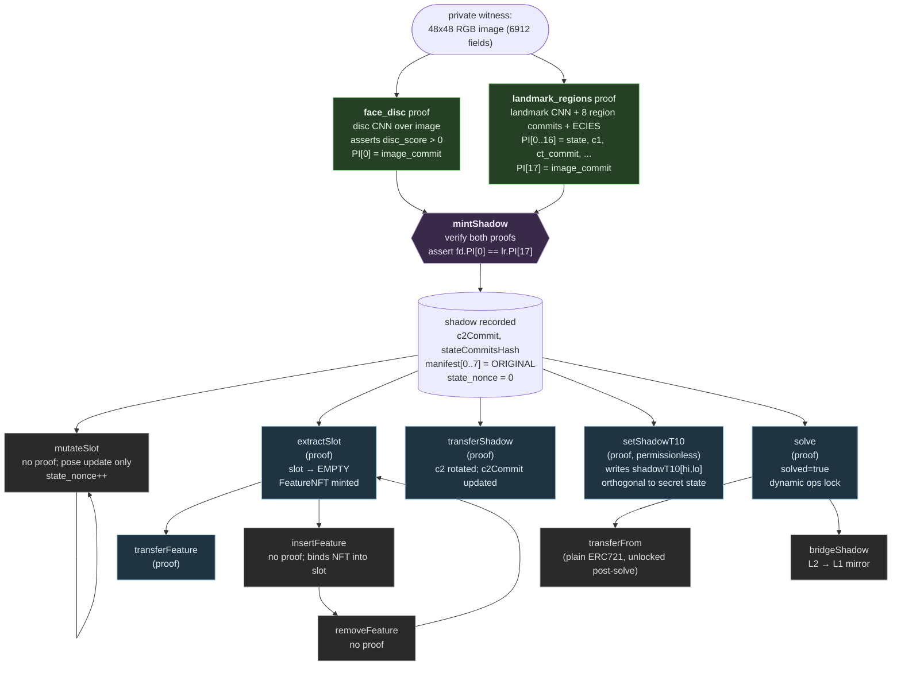

> **v1 historical document.** Describes the v1 circuits
> (`landmark_regions`, `mutate_pose`, `extract_slot`, `transfer`,
> `solve_shadow`, `face_disc`, `shadow_t10` v1) deployed on Base Sepolia.
> The `staging` branch ships v2 circuits with different PI shapes:
> `mutate_slot` (16 PI), `shadow_t10` v2 (20 PI hash circuit),
> `zindex_commit` (2 PI). See [`V2_STATUS.md`](V2_STATUS.md) for the v2
> circuit surface.

---

# Circuits

Seven Noir 1.0.0-beta.19 circuits compile to UltraHonk-Keccak Solidity
verifiers via `bb write_solidity_verifier`. The six verifier-bounded
verifiers (`face_disc` plus the five Phase-2 secret-passing verifiers)
deploy to between 24,337 and 24,342 bytes (≤ 239 bytes of EIP-170
headroom). The T10 verifier is larger and lives in its own deployment
slot. All run under the Base Sepolia per-tx 16,777,216 gas cap.

| Circuit            | Public-input count | Runs at         |
|--------------------|-------------------:|-----------------|
| `face_disc`        | 1                  | `mintShadow` (gate) |
| `landmark_regions` | 18                 | `mintShadow`    |
| `transfer_shadow`  | 8                  | `transferShadow`|
| `extract_slot`     | 10                 | `extractSlot`   |
| `transfer_feature` | 8                  | `transferFeature`|
| `solve_shadow`     | 262                | `solve`         |
| `shadow_t10`       | 9                  | `setShadowT10`  |

## What each proof attests

### `face_disc` (mint gate)

> "The image I'm encrypting is a face: a small CNN discriminator run on
> the same image in i64 fixed-point at scale=1000 produces a positive
> score."

Architecture: `Conv[3->4->8->16->16] + x^2 activation + Global Average
Pool + Linear(16->1)`. ~1791 parameters. Weights at
`tools/landmark/weights/disc_weights.json`; Python reference at
`tools/landmark/discriminator.py` (vendored from pixel-prize-infra).

The circuit:

1. Takes the 6912-element CHW image (3*48*48) as a private witness.
2. Runs the discriminator forward pass in i64 fixed-point.
3. Asserts `score > 0`.
4. Computes and emits `image_commit = poseidon2_sponge_6912(image)`.

Non-face inputs (random noise, off-distribution images) fail step 3 at
`nargo execute` time — there is no proof to submit. See
`tools/test_noise_mint.py` for the negative test.

Public inputs (1):

```
pi[0]      image_commit               (poseidon2_sponge_6912(image))
```

Verifier: `contracts/src/FaceDiscVerifier.sol`, 24,341 deployed bytes
(235 byte EIP-170 headroom). NUMBER_OF_PUBLIC_INPUTS = 9 (= 1 user + 8
internal). At `mintShadow` the contract verifies this proof, the
`landmark_regions` proof, and asserts
`face_disc.PI[0] == landmark_regions.PI[17]` so a single image is bound
by both circuits. Fixture builder: `tools/build_face_disc_fixture.py`,
fixtures at `contracts/test/fixtures/face_disc/<seed>/`.


### `landmark_regions` (mint)

> "I know an image whose 8 region-slices, recolored under palette `color`,
> sponge-hash to these 8 commitments and pack into 249 Fields whose ECIES
> ciphertext (under recipient_pk, given r and k) sponge-hashes to
> `ct_commit`."

This circuit is **face-agnostic on its own**: in isolation it would only
enforce that the prover knows an image consistent with the 8 region
commitments — random noise would verify. Face-gating is delegated to the
`face_disc` proof submitted alongside it; the two are bound to the same
private image via `image_commit` (PI[17]) and the contract requires those
two values to match. The CNN landmark forward pass itself **is** in this
circuit (it produces the landmark coordinates that select the 8 region
slices); what is delegated is only the binary face / not-face decision.
The noise-rejection negative test lives in `tools/test_noise_mint.py`.

Public inputs (18):

```
pi[0..7]   per-feature stateCommit_i  (Poseidon2 sponge of region bytes)
pi[8]      faceOriginId               (Poseidon2(landmarks_packed))
pi[9]      boxes_packed               (8 × (curX, curY, w, h) at 6 bits each)
pi[10]     color                      (uint8)
pi[11]     caller_nonce_commit        (Poseidon2(caller_nonce))
pi[12..13] c1_x, c1_y                 (ECIES ephemeral pubkey)
pi[14]     ct_commit                  (sponge_249 of c2)
pi[15..16] recipient_pk_x, recipient_pk_y
pi[17]     image_commit               (poseidon2_sponge_6912(image) -- must equal face_disc.PI[0])
```

The contract derives the on-chain `shadowId` as
`keccak256(abi.encode(DOMAIN_SHADOW, block.chainid, pi[8])) % FR_MOD`. The
proof itself does not commit to `shadowId` — it commits to `faceOriginId`
and the contract handles chain-binding.

### `transfer_shadow`

> "I know the previous owner's secret key (which decrypts c2 to plaintext
> P), the recipient's public key, and a fresh ephemeral keypair (r, k);
> and the new ciphertext c2_new is a valid ECIES re-encryption of P under
> recipient_pk."

Public inputs (8):

```
pi[0]     shadowId
pi[1..2]  next_pk_x, next_pk_y       (recipient's pk)
pi[3..4]  c1_new_x, c1_new_y         (ECIES ephemeral pubkey)
pi[5]     c2_scalar                  (Poseidon2(shared_x, shared_y) + new_k)
pi[6]     new_ct_commit              (sponge_249 of c2_new)
pi[7]     prev_ct_commit             (sponge_249 of c2 -- must match chain)
```

The contract checks `pi[6] == sponge_249(c2_new_calldata)` and
`pi[7] == s.c2Commit`. The new owner can decrypt with their secret key
because the proof guarantees `c2_new` is correctly re-keyed.

### `extract_slot`

> "I know the shadow's full plaintext P, and `feature_payload[42]` is the
> byte-equal slice of P corresponding to slot `slotIdx`'s feature type,
> and the new feature ciphertext c2_feat is a valid ECIES encryption of
> `feature_payload` under the recipient's pk."

Byte-equality is enforced by unpacking both the shadow plaintext and
`feature_payload` via `to_le_bytes` and asserting per-byte equality across
the appropriate `K_BYTES[ftype]` bytes (with zero-pad on the tail). This
costs ~10k extra constraints over the v0 design but cryptographically
guarantees that the new FeatureNFT contains the byte-correct slice of the
shadow's plaintext.

Public inputs (10):

```
pi[0]      shadowId
pi[1]      slotIdx
pi[2]      originalTypeIdx       (feature type of the slot)
pi[3]      prev_shadow_ct_commit (sponge_249 of shadow's c2)
pi[4..5]   recipient_pk_x, recipient_pk_y
pi[6..7]   c1_x, c1_y            (feature ECIES ephemeral)
pi[8]      c2_scalar             (Poseidon2(shared) + feature_k)
pi[9]      feature_ct_commit     (sponge_42 of c2_feat)
```

### `transfer_feature`

> "I know the previous feature owner's sk (which decrypts the FeatureNFT's
> c2_feat to P_feature), the new owner's pk, and (r, k); the new c2_feat is
> a valid ECIES re-encryption of P_feature under the new owner's pk."

Same shape as `transfer_shadow` but over the 42-Field feature payload
instead of the 249-Field shadow.

Public inputs (8):

```
pi[0]     featureNftId
pi[1..2]  next_pk_x, next_pk_y
pi[3..4]  c1_new_x, c1_new_y
pi[5]     c2_scalar
pi[6]     new_ct_commit         (sponge_42 of c2_feat_new)
pi[7]     prev_ct_commit        (sponge_42 of c2_feat -- must match chain)
```

### `solve_shadow`

> **v2 / reveal-at-solve note (2026-04-28):** the solve flow now atomically
> opens each occupied carrier's `paletteCommit` (16-color palette) AND
> emits the per-slot plaintext at solve time, in addition to revealing the
> z-permutation. The chain-bound check uses on-chain Yul Poseidon2
> (`Poseidon2YulSpongePaletteSalt::sponge_17`), no per-carrier ZK proof.
> As of pipeline #6 (envelope-binding cutover) the contract recomputes
> `sponge_39(plaintexts[i]) == stateCommits[i]` for every occupied slot
> before firing any reveal event, so the emitted plaintexts are bound to
> the proof's PI[1] at the byte level. Tampering with the wire bytes
> reverts the entire solve tx.
> [`REVEAL_AT_SOLVE_DESIGN.md`](REVEAL_AT_SOLVE_DESIGN.md) for the full
> design and [`DEPLOYMENT.md`](DEPLOYMENT.md) for live tx hashes on
> pipeline #5. The historical text below describes the v1 solve circuit
> shape and is preserved for archival continuity.

> "I know the original face image and `caller_nonce`. The 8 region-slices,
> recolored under `color`, sponge-hash to the 8 stateCommits stored at
> mint, and `caller_nonce_commit = Poseidon2(caller_nonce)`."

Effectively a re-attestation of the mint witness: the prover demonstrates
they know the original face. The contract reveals the plaintext (it can
be reconstructed from the published witnesses) and freezes the dynamic
operations.

Public inputs (262): same 18 PI as `landmark_regions` (now including
`image_commit` at PI[17]) plus per-region recolored bytes (244 fields) so
the renderer can reconstruct the canvas without needing the encrypted
ciphertext.

### `shadow_t10`

> "I know the shadow's plaintext (under prev_ct_commit) and the manifest's
> current poses (under poses_hash); the 256 bits I post derive deterministically
> from compositing those bytes under those poses, downsampled and quantized
> to a 16x16 4-level grayscale grid."

Unlike the six secret-passing circuits, `shadow_t10` does **not** rotate
any ciphertext. It produces a public-visible artifact derivable only from
the encrypted state via zk proof. Refresh is lazy and permissionless: any
caller can submit the proof, the contract verifies it, the new T10 lands.

Public inputs (9):

```
pi[0]       shadow_id          (binds proof to this shadow on this chain)
pi[1]       state_nonce        (must equal stateNonce[shadowId] -- replay safe)
pi[2]       prev_ct_commit     (must equal _shadows[shadowId].c2Commit)
pi[3]       boxes_packed       (must equal boxesPackedOf[shadowId])
pi[4]       poses_hash         (must equal sponge_18(manifest poses + 2 zero pads))
pi[5..8]    shadow_q0..q3      (the 256 bits packed as 4 quartet fields)
```

See [`T10.md`](T10.md) for the composite + quantize algorithm, the
sponge_18 padding decision, and the floor-vs-truncate division detail.

## How the proofs compose



Every proof is bound to:

- The chain it executes on (via `block.chainid` baked into `shadowId` and
  `featureNftId` derivation — see [`SECURITY.md`](SECURITY.md))
- The current state of the shadow / feature it operates on (via
  `pi[*] == c2Commit` checks and `pi[0] == bytes32(shadowId)` checks)

Replay across chains, replay against a different shadow, and replay against
a stale ciphertext are all blocked by these bindings.

## Building

Each circuit lives in `circuits/<name>/` with `Nargo.toml` + `src/main.nr`.
To rebuild a verifier from source you need
[`nargo`](https://github.com/noir-lang/noir) 1.0.0-beta.19 and
[`bb`](https://github.com/AztecProtocol/aztec-packages) 5.0.0-nightly.20260419
(checked by `tools/check_toolchain.py`):

```sh
cd circuits/transfer_shadow
nargo compile
bb write_solidity_verifier \
  -k target/transfer_shadow.json \
  -o ../../contracts/src/TransferShadowVerifier.sol \
  --verifier_target evm
```

The generated `TransferShadowVerifier.sol` is byte-equal across rebuilds (the
`bb` toolchain produces deterministic Yul + verification key embedding given
the same circuit). To rebuild the corresponding fixture (a real proof + PI),
use `tools/build_transfer_shadow_fixture.py`.
