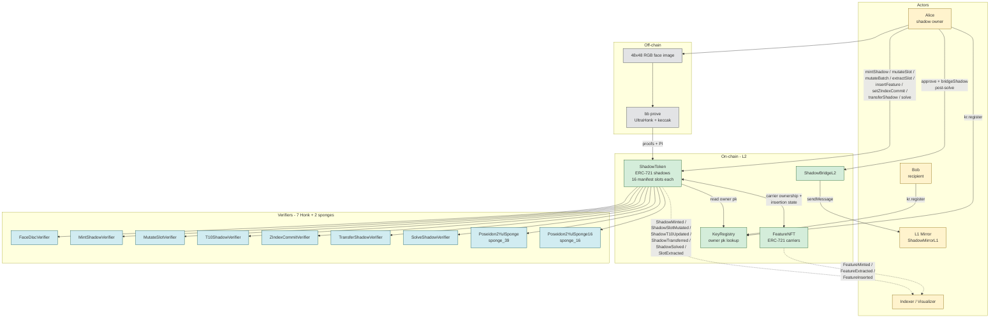
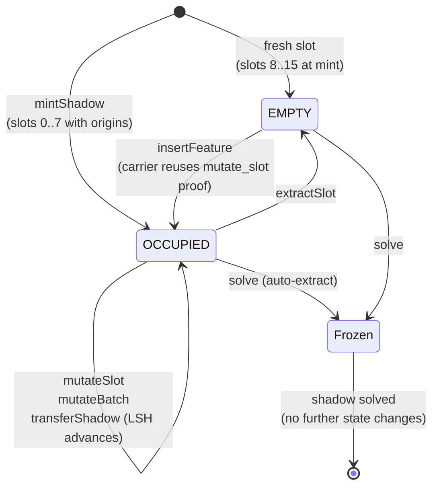
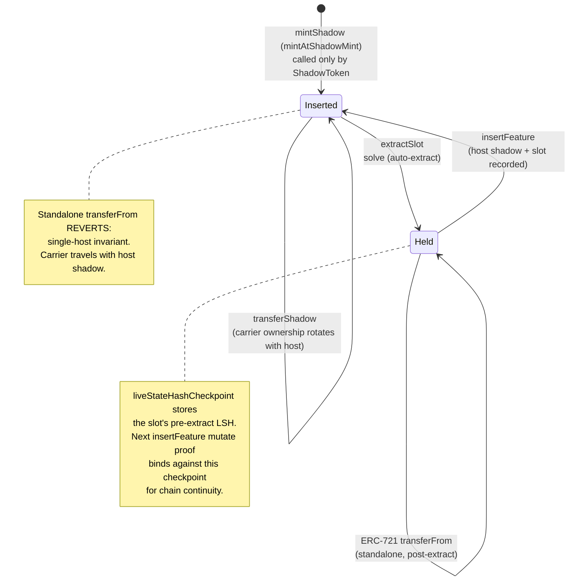
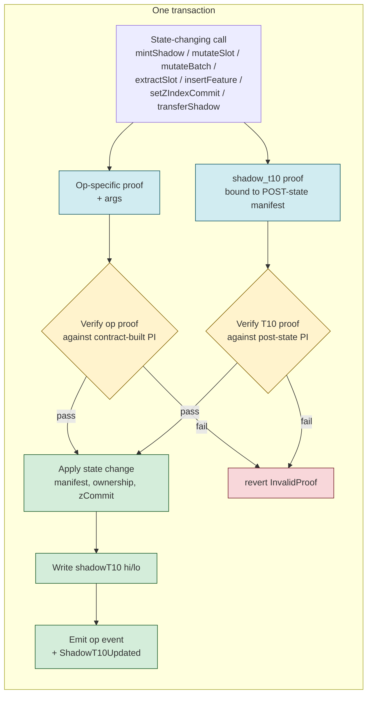
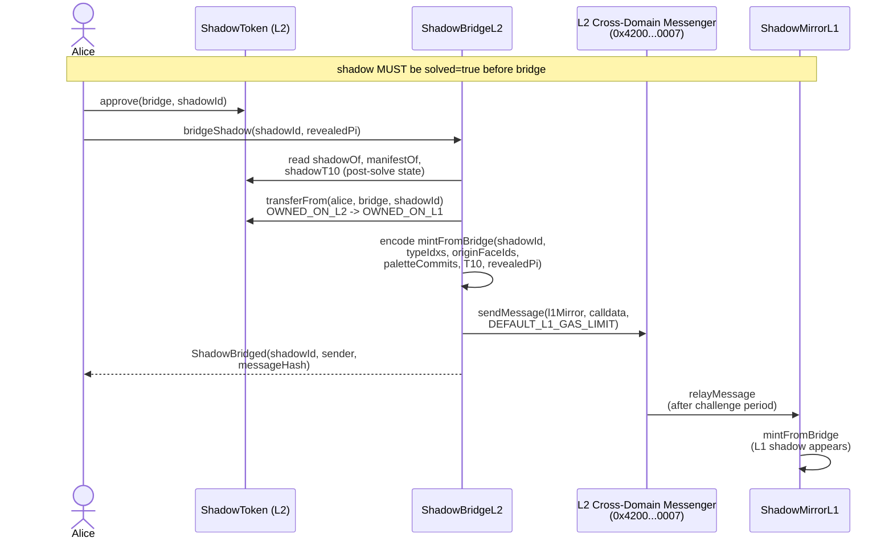

# v2 system flow — mermaid diagrams

Companion to `docs/ARCHITECTURE.md` and `docs/CIRCUITS.md`. This file
captures the v2 protocol in five focused diagrams, current as of
`staging` tip `ac19af2`.

---

## 1. System overview — actors, contracts, circuits



---

## 2. Full lifecycle — one shadow, mint to solve

```mermaid
sequenceDiagram
    actor Alice
    participant Off as Off-chain prover<br/>(nargo + bb)
    participant ST as ShadowToken
    participant FN as FeatureNFT

    Note over Alice,FN: ---------- MINT ----------
    Alice->>Off: face_disc.prove(image)
    Alice->>Off: landmark_regions_v2.prove(image, owner_pk)
    Alice->>Off: shadow_t10.prove(post-mint manifest)
    Alice->>ST: mintShadow(proofMint, proofDisc, proofT10, c2s[8], ...)
    ST->>ST: verify all 3 proofs<br/>(image_commit equality across mint+disc)
    ST->>ST: check mintedOrigins[imageCommit] == false
    ST->>FN: mint 8 carriers, isInserted=true
    ST->>ST: write Shadow + 8 OCCUPIED slots<br/>+ shadowT10
    ST-->>Alice: ShadowMinted + 8x ShadowSlotMutated<br/>+ ShadowT10Updated

    Note over Alice,FN: ---------- MUTATE one slot ----------
    Alice->>Off: mutate_slot.prove(slot=3,<br/>new_pose, new_dims, new_c2 to self)
    Alice->>Off: shadow_t10.prove(post-mutate manifest)
    Alice->>ST: mutateSlot(args)
    ST->>ST: verify mutate + T10 proofs<br/>(slot's old_lsh == storage)
    ST->>ST: advance slot LSH old -> new<br/>refresh shadowT10
    ST-->>Alice: ShadowSlotMutated + ShadowT10Updated

    Note over Alice,FN: ---------- BATCH MUTATE ----------
    Alice->>Off: 2x mutate_slot.prove(slots A, B)
    Alice->>Off: shadow_t10.prove(post-batch manifest)
    Alice->>ST: mutateBatch([entryA, entryB], newT10, proofT10)
    ST->>ST: per-entry verify + apply (loop)<br/>single T10 refresh at end
    ST-->>Alice: 2x ShadowSlotMutated + ShadowT10Updated

    Note over Alice,FN: ---------- COMMIT z-index ----------
    Alice->>Off: zindex_commit.prove(secret permutation)
    Alice->>Off: shadow_t10.prove(post-z manifest)
    Alice->>ST: setZIndexCommit(args)
    ST->>ST: verify z + T10 proofs
    ST->>ST: write Shadow.zIndexCommit<br/>refresh shadowT10 (now binds zCommit)
    ST-->>Alice: ShadowZIndexCommitSet + ShadowT10Updated

    Note over Alice,FN: ---------- EXTRACT one slot ----------
    Alice->>Off: shadow_t10.prove(post-extract manifest)
    Alice->>ST: extractSlot(slotIdx, newT10, proofT10)
    ST->>ST: slot kind=EMPTY, sync carrier checkpoint
    ST->>FN: extractFromShadow(featureId, ...)<br/>isInserted=false
    ST-->>Alice: SlotExtracted + ShadowT10Updated

    Note over Alice,FN: ---------- SOLVE ----------
    Alice->>Off: solve_shadow_v2.prove(<br/>16 plaintexts + permutation)
    Alice->>ST: solve(args) - no T10, frozen post-solve
    ST->>ST: verify solve proof<br/>(state_commits_root + zCommit + lsh_root)
    ST->>ST: solved=true, zIndexRevealed=packed
    ST->>FN: auto-extractFromShadow for every occupied slot
    ST-->>Alice: ShadowSolved + N x SlotExtracted
```

---

## 3. Slot state machine (per shadow, per slot 0..15)



Every transition that mutates the manifest bundles an atomic
`shadow_t10` refresh in the same tx (see diagram 5). `solve` is the
exception: shadow becomes a frozen artifact, no T10 update.

---

## 4. Carrier (FeatureNFT) state machine



---

## 5. Atomic-T10 invariant — every state change in one tx



**Why this matters.** The public `shadowT10` mapping is the indexer +
bridge + visualizer beacon. By bundling its refresh atomically with
every state-change op, the public composite cannot lag behind storage:
any tx that advances the manifest also advances the public T10, in the
same block, gated on both proofs. `solve` is the single exception —
it freezes the shadow, so T10 stays at its last pre-solve value forever.

---

## 6. Bridge to L1 (post-solve)



---

## Notes on what's NOT in these diagrams

- **Chain-tip continuity across extract -> insert.** Implicit in the
  carrier state machine (diagram 4): the carrier's
  `liveStateHashCheckpoint` is the bridge between hosts. The next host's
  `mutate_slot` proof PI[6] (`old_lsh`) must equal that checkpoint for
  the proof to verify. End-to-end byte-equal continuity is enforced
  cryptographically.
- **Replay protection.** Each state-change op is replay-resistant. See
  `ReplayProtection.t.sol` for the per-op semantics:
  - `mintShadow` -> `mintedOrigins[imageCommit]` nullifier
  - `solve` -> `Shadow.solved` flag
  - `mutateSlot` / `mutateBatch` / `extractSlot` -> chain-state-bound
    (storage advances, replayed proof's PI mismatches)
  - `transferShadow` -> `NotShadowOwner` after rotation
  - `insertFeature` -> `FeatureAlreadyInserted` single-host guard
  - `setZIndexCommit` -> idempotent-by-design (proof binds only the
    new commit; T10 still passes if manifest unchanged)
- **Mock messenger in tests.** The L2 cross-domain messenger at
  `0x4200...0007` is `vm.etch`'d in `BridgeShadow.t.sol`; production
  uses the OP-Stack predeploy.
