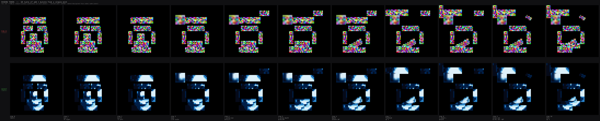

# Ten-turn demo: PUBLIC vs SECRET



A single 48×48 face is minted (step 0), then ten add/mutate operations are
applied. Each step renders two views:

- **PUBLIC** (top, red label) — what an outside observer sees on chain.
  The slot manifest (positions, kinds, poses) is fully visible, but the
  pixel content is the c2 ciphertext bytes — visible as colour noise without
  the recipient's secret key. Watching the public stream over time, you can
  track exactly *where* landmarks live and how their footprints move, but
  the actual content is unreadable.
- **SECRET** (bottom, green label) — what the owner sees with the
  decryption key. Same poses, the actual face plaintext rendered.

The dark rectangles in the PUBLIC row are EMPTY slots — when a new feature
is inserted the rectangle fills with ciphertext noise; when a slot is
extracted (not shown in this programme) the rectangle would re-empty. The
ciphertext content is byte-stable across pose mutations: only the spatial
footprint changes.

## Programme

| Step | Op     | Slot | Pose / target | Note |
|-----:|--------|------|---------------|------|
|    0 | mint   | —    | origPoses[0..7] | initial state |
|    1 | mutate | 1    | (15, 19)        | left eye → +3 right |
|    2 | mutate | 2    | (22, 19)        | right eye → -3 left |
|    3 | mutate | 3    | (5, 10) ×1.5    | nose 1.5x scale |
|    4 | insert | 8    | (32, 5)         | a second eye, upper-right |
|    5 | insert | 9    | (10, 38)        | a second mouth, lower |
|    6 | mutate | 6    | rotate 30°      | mouth rotates |
|    7 | mutate | 0    | (0, 4)          | forehead up 4 |
|    8 | insert | 10   | (0, 0)          | left cheek inserted at upper-left |
|    9 | mutate | 8    | (28,9) ×0.75 -30° | the inserted eye scales + rotates |
|   10 | mutate | 7    | (13, 35)        | chin up 4 |

In the on-chain reality every `mutate` is a [`mutateSlot`](../docs/ARCHITECTURE.md)
call (~44k gas, no proof) and every `insert` is an [`insertFeature`](../docs/ARCHITECTURE.md)
call (~80k gas, no proof — though the FeatureNFT being inserted was minted
through a real `extractSlot` proof). The demo uses byte-source from existing
ORIGINAL slots for the inserts so the visualisation runs without external
fixtures; on chain the inserted slot would point at a separate FeatureNFT id.

## Reproduce

```sh
cd tools
python3 demo_ten_turns.py --out ../examples/demo_ten_turns.png --scale 10
```

The script reads the alice0 mint fixture's c2 + recipient sk, decrypts
once for the SECRET row and uses the raw c2 ciphertext bytes for the
PUBLIC row, then steps through `PROGRAMME` rendering both views per step.
Modify `PROGRAMME` in the script to compose your own sequence.

The mint fixture used here is the same one all 100 forge unit tests + both
Sepolia scenarios validate against. The decryption is real: the SECRET row
is byte-identical to the canonical Python simulation in `validate_pixels.py`.
